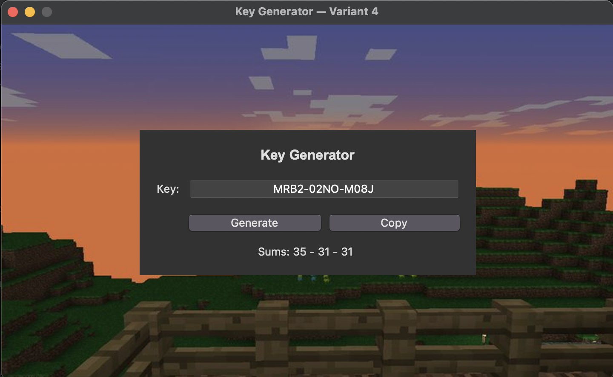

# Lab-3 — Key Generator (Variant 4)

## 📌 Description
A simple **Keygen** built with **Tkinter**.  
Generates keys in the format:

XXXX-XXXX-XXXX

Characters: **A–Z** and **0–9**.  
For Variant 4, each 4-character block has a weight sum in **[30..35]**  
(A=1..Z=26, digits=0–9).

